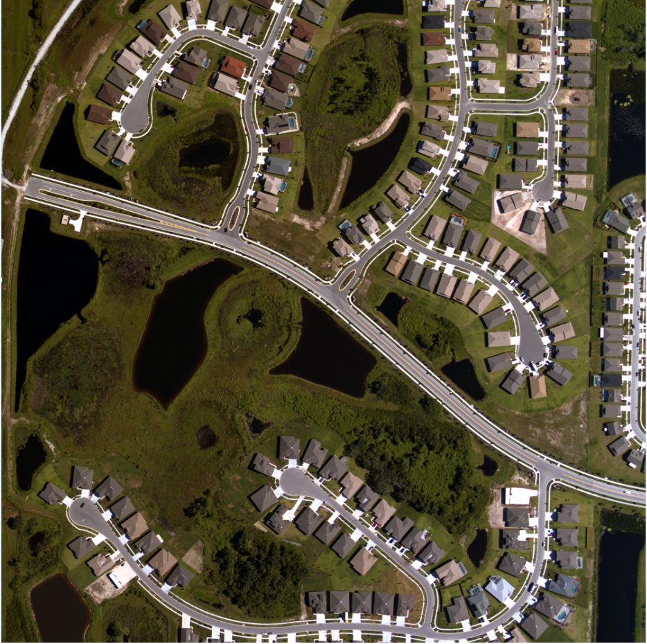

# LIBGD

LIBGD is A Fast, Light Library For Remote Sensing Image Processing Written With C++, Completed By A Study Group From the Department of Urban Spatial Information Engineering, Shenzhen University.

To compile it. You need use Cmake.

This Project  relies on ceres, glog, gflag, and I provide a CMakeList Which Generate Another Project In Order to Compile This to Dynamic Link Library for Python(.pyd). The Project has included the heads file you need and the .lib files. If something went wrong on your computer when you build the project, I believe you can **Fix this with your On**. GoodLuck.

Until now, we have acomplished some classic algorithms, such as IHSFusion, GIHSFusion, AIHSFusion, IAIHSFusion in Image Fusion field, SLIC in Image Segmentation field and Some basic operators with image, including filters etc. If you have any problem, contact 936543814@qq.com. 

